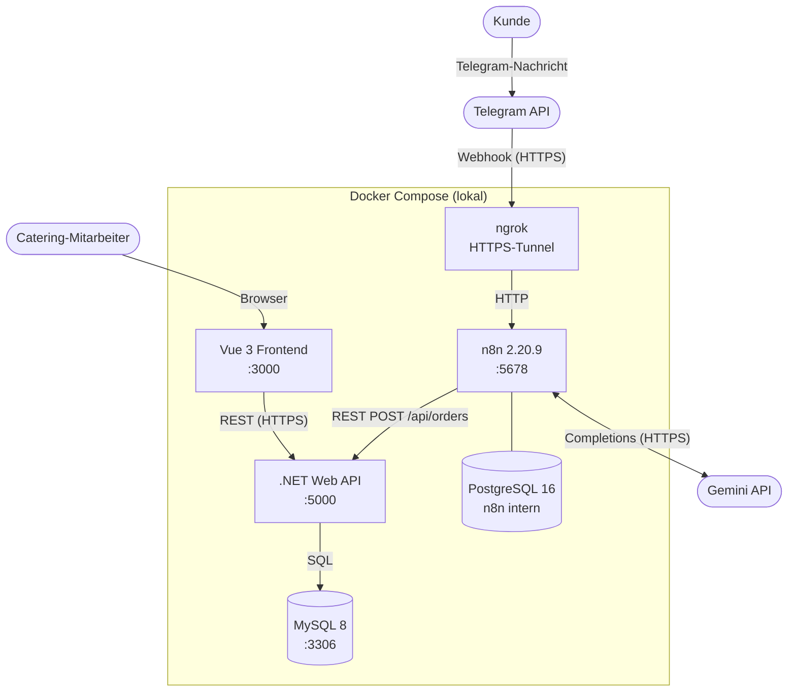
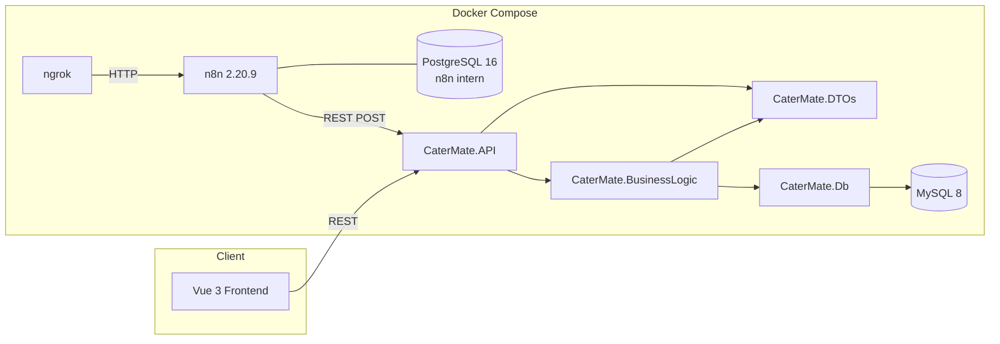
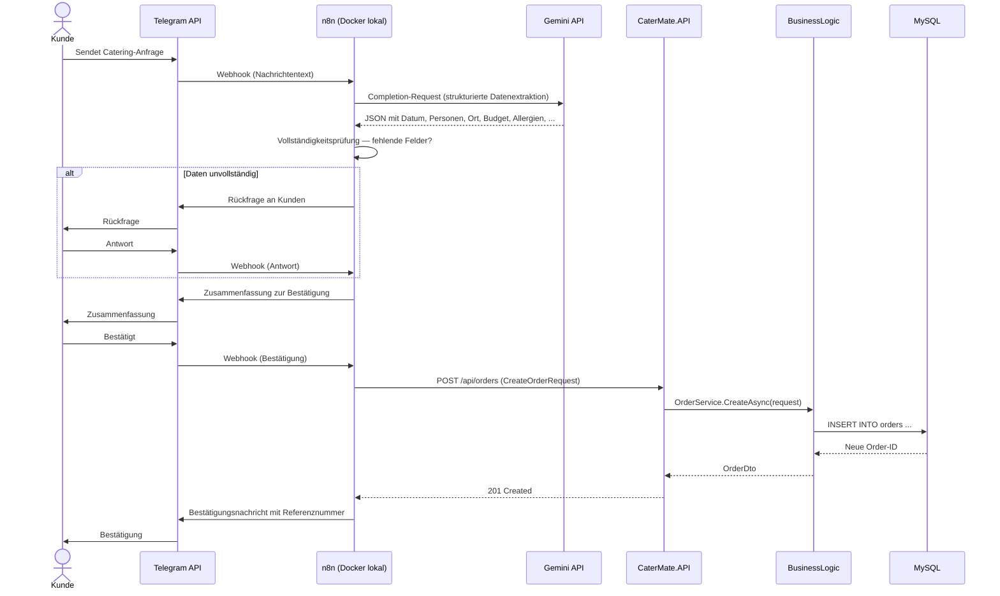
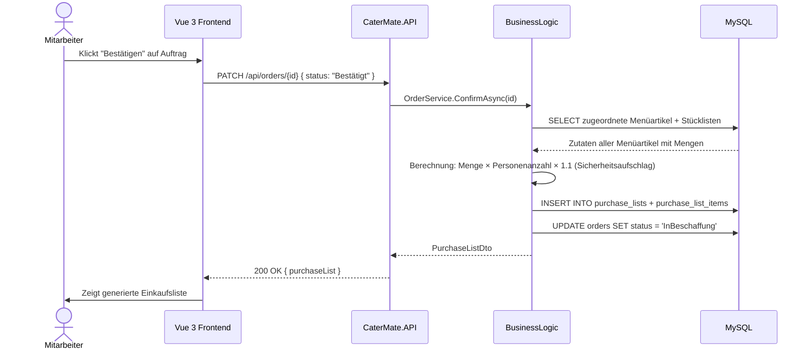
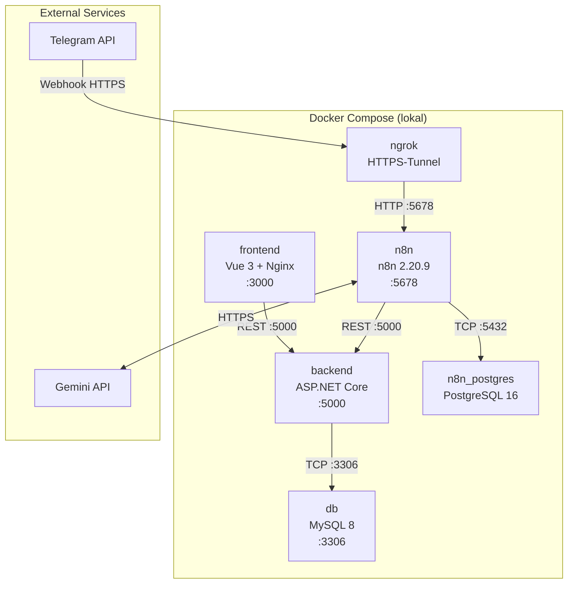

# Systemarchitektur — CaterMate ERP

arc42-orientierte Architekturdokumentation, reduziert auf die projektrelevanten Kapitel.

---

## 1. Systemübersicht & Ziele

### Zweck

CaterMate ERP ist eine webbasierte Catering-Management-Anwendung, entwickelt im Rahmen eines FH-Projekts. Sie bildet den vollständigen End-to-End-Prozess eines Catering-Unternehmens ab: vom eingehenden Kundenauftrag (via Telegram-Bot) über Angebotserstellung und Einkaufsplanung bis zur Rechnungslegung. Der Fokus liegt auf einem stabilen, erweiterbaren MVP — kein Prototyp, sondern eine auslieferbare Anwendung.

### Qualitätsziele

| # | Ziel | Beschreibung | Maßnahme |
|---|------|-------------|----------|
| Q1 | **Kollektives Systemverständnis** | Jedes Teammitglied versteht das Gesamtsystem, nicht nur den eigenen Layer | Klare Layer-Trennung, Code-Guidelines, diese Architekturdokumentation |
| Q2 | **Testabdeckung** | Unit Tests für Business-Logik; Integration Tests für alle Use Cases UC-01 bis UC-09 | Testpflicht vor Merge; CI prüft Tests im PR-Workflow |
| Q3 | **Wartbarkeit & Erweiterbarkeit** | Keine Shortcuts — die Anwendung soll nach dem Semester erweiterbar bleiben | Strikte Dependency-Regeln, keine zyklischen Abhängigkeiten, saubere API-Kontrakte |

### Stakeholder

| Rolle | Interesse | Bezug zur Architektur |
|------|-----------|----------------------|
| FH-Lehrende | Korrekte Umsetzung der Anforderungen, nachvollziehbare Entscheidungen | Funktionsumfang, Testabdeckung, Dokumentationstiefe |
| Entwicklungsteam | Klare Verantwortlichkeiten, wenig Reibung beim Zusammenarbeiten | Layer-Trennung, Code-Guidelines, einheitliche Muster |
| Endanwender (Catering-Mitarbeiter) | Schnelle, verlässliche Bedienung der Web-Oberfläche | Frontend-UX, API-Stabilität, Fehlerbehandlung |

---

## 2. Systemkontext

### Fachlicher Kontext

CaterMate ERP kommuniziert mit folgenden externen Akteuren:

| Akteur | Richtung | Beschreibung |
|-------|----------|-------------|
| Kunde | → System | Sendet Catering-Anfrage via Telegram-Chat |
| Catering-Mitarbeiter | ↔ System | Verwaltet Aufträge, Stammdaten, Angebote, Rechnungen via Web-UI |
| Telegram API | ↔ n8n | Messaging-Kanal für eingehende Kundenanfragen; n8n empfängt Webhooks |
| Gemini API | ↔ n8n | Sprachmodell für Datenextraktion aus Kundennachrichten und OCR-Auswertung |
| n8n (Docker lokal) | → Backend-API | KI-Orchestrator; schreibt strukturierte Auftragsdaten via REST ins System |
| ngrok | → n8n | HTTPS-Tunnel — macht n8n lokal für Telegram-Webhooks erreichbar |

### Systemkontext-Diagramm



### Externe Schnittstellen

| Schnittstelle | Protokoll | Betreiber | Richtung |
|--------------|----------|----------|---------|
| Telegram Bot API | HTTPS / Webhook | Telegram | Eingehend → n8n |
| Gemini API | HTTPS / REST | Google | n8n → ausgehend |
| CaterMate Backend API | HTTPS / REST | intern | n8n → Backend |

---

## 3. Technischer Stack

### Tech-Stack

| Schicht | Technologie | Begründung |
|---------|------------|-----------|
| Frontend | Vue 3 + PrimeVue + Vite | Composition API für klare Komponentenlogik; PrimeVue liefert produktionsreife UI-Komponenten ohne eigenes Design-System |
| Backend | ASP.NET Core Web API (C#) | Typsicher, hohe Performance, gut vertrautes Ökosystem im Team |
| Datenbankzugriff | Dapper (Raw SQL) | Direkte Kontrolle über SQL-Queries; kein ORM-Overhead; transparent und testbar |
| Datenbank | MySQL 8 | Weit verbreitet, Docker-freundlich; für das relationale Datenmodell vollständig ausreichend |
| PDF-Generierung | QuestPDF | Code-first PDF-Erstellung in C#; kein externer Template-Server notwendig |
| KI-Orchestrierung | n8n 2.20.9 | KI-Workflows visuell änderbar ohne Backend-Redeployment; klar getrennte Verantwortlichkeit |
| Messaging-Kanal | Telegram Bot API | Eingehende Kundenanfragen via Webhook; ngrok tunnelt lokal |
| Containerisierung | Docker + Docker Compose | Einheitliche Entwicklungsumgebung für alle Teammitglieder |

---

## 4. Bausteinsicht (arc42 Kap. 5)

### Layer-Übersicht



**Dependency-Regel:** `API → BusinessLogic → Db`. Das Db-Projekt kennt weder API noch BusinessLogic. DTOs sind von API und BusinessLogic verwendbar, niemals von Db. Keine zyklischen Abhängigkeiten.

### Layer-Beschreibungen

#### 1. Frontend — Vue 3 + PrimeVue + Vite

**Verantwortlich für:** Darstellung aller Masken (Auftragsübersicht, Stammdaten, Angebot, Einkaufsliste, Rechnung, Dashboard). Kommuniziert ausschließlich via REST mit dem Backend.

**Nicht verantwortlich für:** Business-Logik, Preisberechnung, PDF-Generierung. Keine direkte Datenbankverbindung.

```
frontend/
├── src/
│   ├── components/       # Wiederverwendbare UI-Bausteine (PascalCase.vue)
│   ├── views/            # Seitenkomponenten, eine pro Route
│   ├── composables/      # Logik-Hooks (useOrderStore.ts, useApi.ts)
│   └── router/           # Vue Router Konfiguration
```

---

#### 2. Backend — CaterMate.API

**Verantwortlich für:** HTTP-Routing, Request-Deserialisierung, Response-Serialisierung, globale Middleware (Fehlerbehandlung nach RFC 7807, Logging).

**Nicht verantwortlich für:** Geschäftslogik, Datenbankzugriff, Berechnungen — alles wird an BusinessLogic delegiert.

**Muster:** Ein Controller pro Ressource (`OrdersController`, `MenuItemsController`, ...). Controller-Methoden rufen ausschließlich einen Service auf und geben dessen Ergebnis zurück. Keine Logik in Controllern.

---

#### 3. Backend — CaterMate.BusinessLogic

**Verantwortlich für:** Alle fachlichen Berechnungen (Angebotspreis, Einkaufslistenmengen, österreichische USt.), Statusübergänge des Auftrags, PDF-Generierung via QuestPDF, Koordination von AI-bezogenen Antworten falls Backend direkt angefragt wird.

**Nicht verantwortlich für:** HTTP-Details, Raw SQL, DTO-Serialisierung zum Client.

| Service | Verantwortlichkeit |
|---------|------------------|
| `OrderService` | Auftrags-CRUD, Statusübergänge |
| `QuoteService` | Angebotsberechnung (Positionen × Personen, Marge, USt. 10%/20%) |
| `PurchaseListService` | Einkaufslisten-Generierung (Zutaten × Personenanzahl × Sicherheitsaufschlag) |
| `InvoiceService` | Rechnungserstellung, fortlaufende Nummerierung |
| `PdfService` | PDF-Generierung via QuestPDF für Angebote und Rechnungen |
| `SuggestionService` | Gerichtsvorschläge aus dem Menükatalog anhand von Kundenwünschen |

---

#### 4. Backend — CaterMate.Db

**Verantwortlich für:** Datenbankzugriff via Dapper. Gibt ausschließlich DB-Entitäten zurück — keine DTOs, keine Business-Logik. SQL-Strings als benannte Konstanten, nicht inline im Code.

**Nicht verantwortlich für:** Business-Logik, DTO-Mapping, HTTP.

```csharp
public class OrderRepository
{
    private const string SelectById = "SELECT * FROM orders WHERE id = @Id";

    public async Task<Order?> GetByIdAsync(int id) =>
        await _connection.QueryFirstOrDefaultAsync<Order>(SelectById, new { Id = id });
}
```

---

#### 5. Backend — CaterMate.DTOs

**Verantwortlich für:** Shared Data Transfer Objects zwischen API und BusinessLogic. Reine Datencontainer — keine Methoden, keine Logik.

**Wichtige Unterscheidung:**
- `OrderEntity` — DB-Entität, 1:1 Tabellen-Mapping (nur in `CaterMate.Db`)
- `OrderDto` — API-Antwort-Objekt
- `CreateOrderRequest` — Eingehende Anfrage vom Client oder n8n

---

#### 6. Datenbank — MySQL 8

**Verantwortlich für:** Persistente Speicherung aller Domänendaten (Aufträge, Menüartikel, Zutaten, Angebote, Einkaufslisten, Rechnungen). Läuft im Docker-Container und ist ausschließlich über `CaterMate.Db` erreichbar — kein direkter Datenbankzugriff aus anderen Schichten.

**Nicht verantwortlich für:** Business-Logik, Berechnungen, Datenvalidierung — das ist Aufgabe des Backend-Layers.

**Schema-Management:** Kein Code-First, keine automatischen Migrations. Das Schema wird als explizites SQL-Skript (`database/schema.sql`) versioniert und beim Container-Start angewendet.

---

#### 7. n8n-Stack (Docker Compose) — KI-Orchestrator

Der n8n-Stack besteht aus drei Containern:

| Container | Image / Build | Aufgabe |
|-----------|--------------|---------|
| `n8n` | Custom (`ai-service/Dockerfile`), n8n 2.20.9 | Workflow-Engine; Port `N8N_PORT` (5678) |
| `n8n_postgres` | `postgres:16` | n8n-eigene Datenbank (getrennt von MySQL) |
| `ngrok` | `ngrok/ngrok:latest` | HTTPS-Tunnel — macht n8n für Telegram-Webhooks erreichbar |

**n8n verantwortlich für:** Telegram-Bot-Integration (Webhook-Empfang und Antwort), Gesprächsführung mit dem Kunden, Datenextraktion via Gemini, OCR-Workflow für Lieferantenrechnungen. Sendet strukturierte Daten via REST an das CaterMate Backend.

**Nicht verantwortlich für:** Datenhaltung, fachliche Berechnungen, PDF-Generierung.

**Schnittstelle zum Backend:** `POST /api/orders` mit extrahiertem Auftrags-JSON.

**Workflows:** Werden aus `ai-service/workflows/` in den Container gemountet (`/workflows`). Export via `ai-service/export_workflows.bat`.

**Lokaler Erstzugang:** n8n-Admin-Login mit `N8N_USER` / `N8N_PASSWORD` aus `.env.dev`.

---

## 5. Laufzeitsicht

### Szenario 1: Telegram-Anfrage → Auftrag anlegen



### Szenario 2: Auftrag bestätigen → Einkaufsliste generieren



---

## 6. Verteilungssicht



**Umgebungsvariablen:** Alle Secrets (DB-Passwort, Gemini-API-Key, Telegram-Bot-Token, n8n-Zugangsdaten, ngrok-Authtoken) werden via `.env.dev` übergeben. `.env.dev` wird **nicht** eingecheckt — `.env.example` dient als Vorlage.

**Wichtig beim Start:** Docker Compose liest für Variable-Substitution im YAML automatisch `.env`, nicht `.env.dev`. Start daher immer mit:
```bash
docker compose --env-file .env.dev up --build
```
Alternativ: `cp .env.dev .env` einmalig ausführen (`.env` ebenfalls nicht einchecken).

**ngrok-Setup:** `NGROK_AUTHTOKEN` und `WEBHOOK_URL` müssen in `.env.dev` gesetzt sein. Den Authtoken gibt es kostenlos unter [ngrok.com](https://ngrok.com). Die öffentliche Tunnel-URL (`WEBHOOK_URL`) entspricht der ngrok-Domain und muss als Telegram-Webhook registriert werden.
