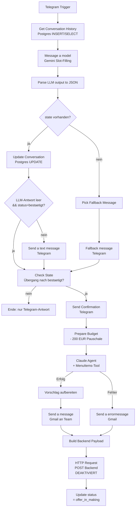
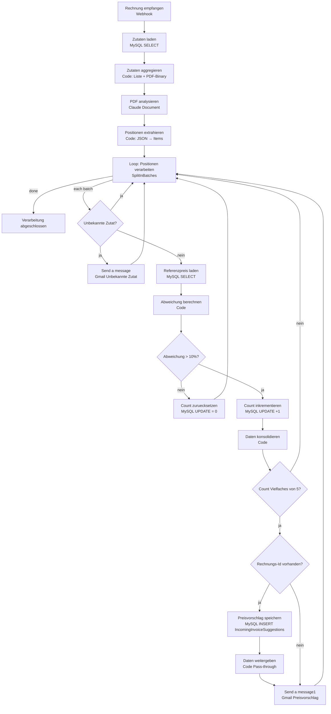
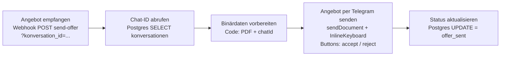

# Workflows — Detaillierte Beschreibung

Drei n8n-Workflows bilden die KI-Orchestrierungsschicht von CaterMate-ERP. Diese Datei beschreibt jeden Workflow nach Trigger, Datenfluss, Integrationen und Output. Die Systemprompts der KI-Modelle sind in [system-prompts.md](system-prompts.md) separat dokumentiert. Test-Rezepte stehen in [testing.md](testing.md).

---

## Workflow 1 — Anfrage über Telegram-Bot erfassen

**ID:** `vZ98OhxobtxUn3JC`

### Zweck

Kunden erfassen Catering-Anfragen über einen Telegram-Bot. Ein Gemini-Modell führt das Gespräch im Slot-Filling-Stil und sammelt alle Pflichtfelder (Datum, Anlass, Personenanzahl, Budget, Ort, Speisewünsche, Allergien, sonstige Wünsche). Sobald der Kunde die Anfrage bestätigt, generiert ein Claude-Agent aus dem `MenuItems`-Katalog einen passenden Menüvorschlag, der per E-Mail an das Team geht.

### Trigger

| | |
|---|---|
| Typ | Telegram-Trigger |
| Event | `message` |
| Externer Zugriff | Telegram-Bot über Webhook (ngrok-URL) |

### Integrationen

- **PostgreSQL (n8n_postgres):** Tabelle `konversationen` — speichert pro Telegram-Chat den `state` als JSONB (alle Anfrage-Felder, status, fehlende_felder, …).
- **MySQL (db):** Tabelle `MenuItems` — wird vom Claude-Agent als Tool abgefragt, um Menüvorschläge zu erstellen.
- **Gmail:** Versendet die finale Anfrage-Zusammenfassung + KI-Menüvorschlag an `thomas1.madlberger@gmail.com`.
- **Backend (HTTP POST):** Aktuell **deaktivierter** Knoten — würde die Anfrage später als Auftrag im Backend anlegen (`/api/n8n/orders`).

### KI-Modelle

| Knoten | Modell | Aufgabe | Systemprompt |
|---|---|---|---|
| `Message a model` | Google Gemini 3.5 Flash | Slot-Filling-Dialog mit dem Kunden; gibt strukturiertes JSON mit `state` und `antwort_text` zurück | Siehe [system-prompts.md](system-prompts.md#workflow-1--gemini-slot-filling) |
| `Agent: Generate Proposal of Offer` | Claude Sonnet 4.6 (Agent) | Wählt aus `MenuItems` eine passende Kombination; respektiert Budget, Allergien und Wünsche | Siehe [system-prompts.md](system-prompts.md#workflow-1--claude-menü-agent) |
| `Structured Output Parser` | Claude Sonnet 4.6 (Sub-Modell) | Erzwingt das `proposal`-JSON-Schema des Agents | n/a (Schema-only) |

### Datenfluss

### State-Tabelle `konversationen`

| Spalte | Typ | Inhalt |
|---|---|---|
| `konversation_id` | VARCHAR PK | Telegram-Chat-ID |
| `state` | JSONB | Gesamter Anfrage-State inkl. `anfrage`, `status`, `letzte_antwort`, `fehlende_felder`, `datum_uhrzeit_konkret_abgefragt` |
| `status` | VARCHAR(50) | Lifecycle-Status: `chatting`, `offer_in_making`, `offer_sent`, `offer_accepted`, `offer_rejected` |
| `aktualisiert_am` | TIMESTAMP | Letzte Änderung |

### Output

- **Telegram:** Antwort des Gemini-Bots an den Kunden, plus Confirmation bei `status=bestaetigt`.
- **E-Mail:** Strukturierte Zusammenfassung mit allen Anfragefeldern + KI-Menüvorschlag inkl. Preisen und Budget-Check.
- **DB:** `konversationen.status = offer_in_making` nach erfolgreichem Lauf.

---

## Workflow 2 — Eingangsrechnung: Preisüberwachung

**ID:** `fB4pUHDqK8Z25Rrd`

### Zweck

Eingangsrechnungen (PDFs) werden vom Backend an einen Webhook geschickt. Ein Claude-Modell extrahiert die Rechnungspositionen und ordnet sie per Fuzzy-Matching den Stammdaten-Zutaten zu. Für jede Position wird die Preisabweichung gegen den Referenzpreis berechnet. Sobald derselbe Artikel **fünfmal in Folge** mehr als **10 %** über dem Referenzpreis liegt, sendet das System einen Preisvorschlag per E-Mail und legt eine Zeile in `IncomingInvoiceSuggestions` an, die der User später im Backend bestätigen oder verwerfen kann.

### Trigger

| | |
|---|---|
| Typ | Webhook |
| Production-URL | `POST <ngrok>/webhook/invoice-check` |
| Test-URL | `POST <ngrok>/webhook-test/invoice-check` |
| Body | multipart/form-data: `file=@<rechnung>.pdf` + `incomingInvoiceId=<INT>` |

Das Form-Feld `incomingInvoiceId` wird vom Backend mitgegeben — es zeigt auf die bereits angelegte Zeile in `IncomingInvoices`. Fehlt das Feld (z. B. beim curl-Test), wird der DB-INSERT übersprungen, die E-Mail-Benachrichtigung kommt aber trotzdem.

### Integrationen

- **MySQL (db):**
  - `Ingredients` — Stammdaten + `consecutive_over_count` als Zähler.
  - `IncomingInvoices` — Parent-Zeile vom Backend (FK).
  - `IncomingInvoiceSuggestions` — neue Vorschläge werden hier eingefügt.
- **Anthropic API (Claude):** PDF-Analyse mit Fuzzy-Matching gegen Zutatenliste.
- **Gmail:** Zwei Mail-Pfade:
  - Unbekannte Zutat → sofort beim ersten Match-Miss.
  - Preisvorschlag → bei jedem 5. konsekutiven Treffer.

### KI-Modelle

| Knoten | Modell | Aufgabe | Systemprompt |
|---|---|---|---|
| `PDF analysieren` | Claude Sonnet 4.6 (document input) | Liest das PDF binär, extrahiert Rechnungspositionen und matcht jede Position fuzzy gegen die Zutatenliste | Siehe [system-prompts.md](system-prompts.md#workflow-2--claude-pdf-analyse) |

### Datenfluss

### DB-Tabellen

**`Ingredients`** (Auszug):

| Spalte | Typ | Zweck |
|---|---|---|
| `Id` | INT PK | Referenz |
| `Name` | VARCHAR | Anzeigename |
| `Unit` | VARCHAR | Einheit (Stk, kg, L, …) |
| `PurchasePricePerUnit` | DECIMAL | Referenz-Einkaufspreis |
| `consecutive_over_count` | INT | Zähler: aufeinanderfolgende Rechnungen >10% drüber |

**`IncomingInvoiceSuggestions`** (vom Workflow befüllt):

| Spalte | Typ | Quelle |
|---|---|---|
| `Id` | INT PK AUTO_INCREMENT | DB |
| `IncomingInvoiceId` | INT FK | Webhook-Form-Feld `incomingInvoiceId` |
| `IngredientId` | INT FK | Match aus Claude |
| `CurrentPrice` | DECIMAL | aktueller DB-Referenzpreis |
| `SuggestedPrice` | DECIMAL | Rechnungspreis (über Referenz) |
| `Accepted` | TINYINT NULL | NULL — User entscheidet später im Backend |

### Output

- **E-Mail:** Preisvorschlag-Mail bei 5er-Trigger, optional Unbekannte-Zutat-Mail bei Match-Miss.
- **DB:** Neue Zeile in `IncomingInvoiceSuggestions` (nur wenn `incomingInvoiceId` mitgesendet wurde).
- **DB:** `Ingredients.consecutive_over_count` wird laufend aktualisiert.

---

## Workflow 3 — Angebot versenden

**ID:** `kKC4wdFqpThxbSr2`

### Zweck

Sobald das Backend ein Angebots-PDF generiert hat, ruft es diesen Workflow auf. Der Workflow schickt das PDF per Telegram an den Kunden — mit Inline-Buttons zum verbindlichen Annehmen oder Ablehnen — und setzt den Konversations-Status auf `offer_sent`.

### Trigger

| | |
|---|---|
| Typ | Webhook |
| Production-URL | `POST <ngrok>/webhook/send-offer?konversation_id=<chat-id>` |
| Test-URL | `POST <ngrok>/webhook-test/send-offer?konversation_id=<chat-id>` |
| Body | multipart/form-data: `data=@<angebot>.pdf` |
| Query | `konversation_id=<telegram-chat-id>` |

### Integrationen

- **PostgreSQL (n8n_postgres):** Tabelle `konversationen` — Lookup der Chat-ID + Status-Update nach Versand.
- **Telegram:** Versendet das PDF an den Kunden mit Inline-Keyboard (`accept` / `reject`).

### KI-Modelle

Keine — reine Orchestrierung.

### Datenfluss

### Inline-Buttons

Bei Klick im Telegram-Chat sendet Telegram eine Callback-Query mit:
- `accept:<konversation_id>` → Annahme
- `reject:<konversation_id>` → Ablehnung

⚠️ Diese Callbacks werden **derzeit nicht von einem Workflow verarbeitet** — die Folgelogik (Status auf `offer_accepted`/`offer_rejected` setzen) lebt noch nicht. Späterer Ausbau.

### Output

- **Telegram:** PDF beim Kunden im Chat, mit zwei Buttons unter der Nachricht.
- **DB:** `konversationen.status = offer_sent`, `aktualisiert_am = NOW()`.

---

## Workflow-übergreifender Kontext

### Sprachregel

- **Node-Labels (UI-sichtbar):** Deutsch
- **Code, Variablen, Workflow-Dateinamen:** Englisch (Konvention aus [CLAUDE.md](../CLAUDE.md))

### Naming-Konvention für Sub-Workflows

`Tool: <Name>` — kennzeichnet einen aufrufbaren Sub-Workflow für einen Haupt-Agent. Aktuell noch nicht verwendet.

### Credentials

| Name | Typ | Verwendet in |
|---|---|---|
| `MySQL account` | mySql | Workflow 2 (alle SQL-Knoten) |
| `Postgres account` | postgres | Workflow 1 + 3 |
| `Gmail account` | gmailOAuth2 | Workflow 1 + 2 |
| `Telegram account` | telegramApi | Workflow 1 + 3 |
| `Anthropic account` | anthropicApi | Workflow 2 |
| `Google Gemini(PaLM) Api account` | googlePalmApi | Workflow 1 |

### Out-of-Scope für n8n (laut [CLAUDE.md](../CLAUDE.md))

n8n erstellt **keine** neuen Gerichte, berechnet **keine** Preise/USt., generiert **keine** PDFs und führt **keine** Bestände. Diese Logik liegt im Backend (`CaterMate.BusinessLogic` / QuestPDF).
